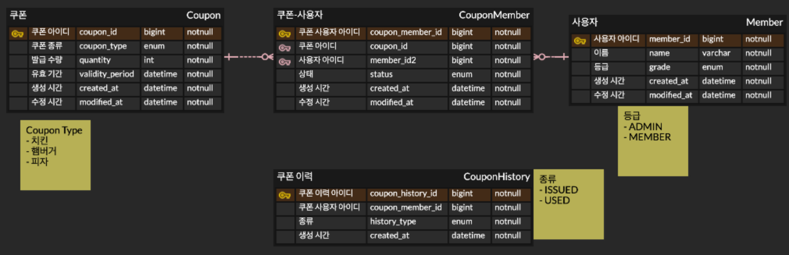
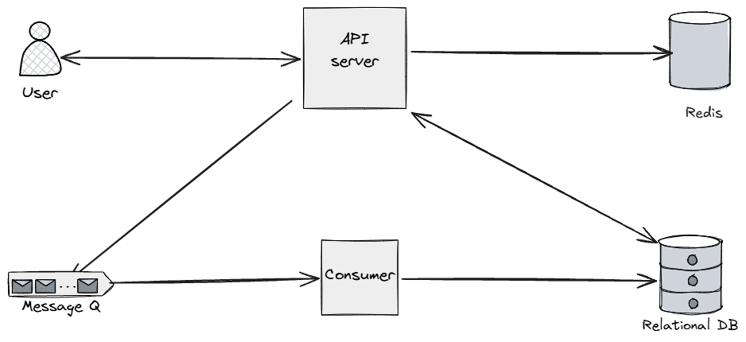
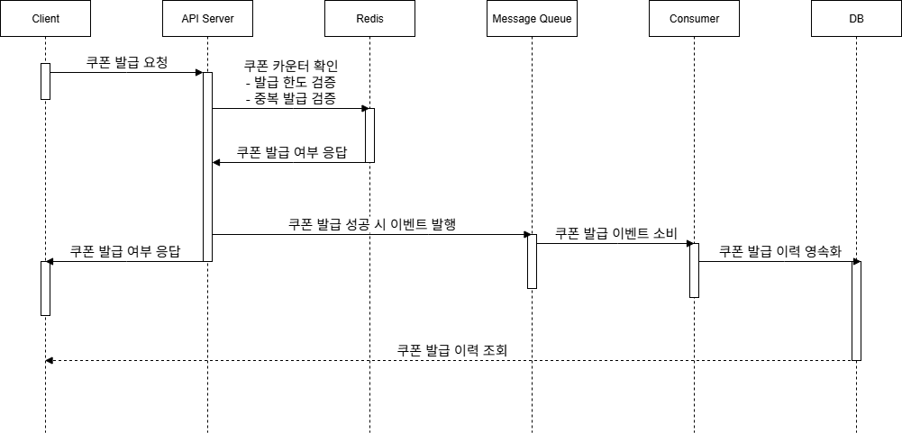
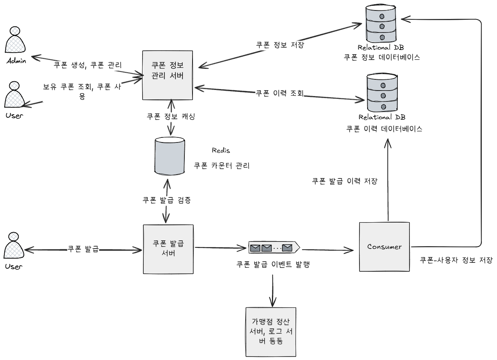

# Coupon_Dispatcher
쿠폰 발급 시스템 설계
***
  
## 목표
- 특정 시간에 한정된 수량의 쿠폰을 선착순으로 받을 수 있는 시스템 설계가 목표입니다.

## ERD


## 시스템 아키텍처


---
## 쿠폰 발급 플로우


트래픽이 몰리는 시점에 Lost Update 문제가 발생하여 쿠폰이 oversell 될 수 있습니다. 이를 해결하기 위해 다음의 두 가지 방법을 고민했습니다.
- 락을 이용한 동시성 제어.
- **빠른 연산 성능을 지니고, 원자적 증가를 지원하는 데이터베이스 사용. (선택방안)**

락을 사용하면 동시성은 제어할 수 있지만, 쿠폰 레코드에 대한 트랜잭션의 race condition이 발생해 성능적 측면에서
빠른 연산 처리 성능을 지닌 In-Memory 데이터베이스인 Redis를 사용하여 구현하였습니다.

Singe thread 기반으로 동작하는 Redis Event loop에서는 Lua Script를 단일 명령어로 취급해 원자적 처리가 가능합니다.<br>
다음 Lua Script를 통해 Set을 통해 중복 발급을 검증하고, 쿠폰 발급 한도를 검증했습니다.
~~~
-- 발급한 사용자 검증용
local issuedMemberSet = KEYS[1]
-- 쿠폰 한도 검증용
local couponCounter = KEYS[2]
local limit = tonumber(ARGV[1])
local memberId = ARGV[2]
			
-- 발급된 수량, 기본값 0
local issued = tonumber(redis.call('GET', couponCounter) or '0')
	
-- 발급 한도 검증
if issued >= limit then 
-- 1: 이미 품절된 쿠폰입니다.
return 1
end
	
-- 중복 발급 검증
if redis.call('SISMEMBER', issuedMemberSet, memberId) == 1 then 
-- 2: 이미 발급한 쿠폰입니다.
return 2
end
	
redis.call('SADD', issuedMemberSet, memberId)
redis.call('INCR', couponCounter)
	
-- 쿠폰 발급에 성공
return 0
~~~

쿠폰 발급이 성공하면 메세지 큐에 쿠폰 발급 이벤트를 발행해 컨슈머 측에서 이를 소비해 비동기로 DB에 영속화합니다. 다음과 같은 두 가지 이유로
메시지 큐를 도입하였습니다.
- 쿠폰 이력을 저장하는 로직이 무거우면 트래픽이 몰리는 시점에서 API 서버에 부하가 생길 것입니다.
- 쿠폰을 발급함으로써 이를 처리해야 하는 다른 서비스가 존재할 경우 확장성을 위함입니다.
  - ex) 쇼핑몰에서 이를 발급 시, 가맹점에 지급해야 할 쿠폰 대금 처리

---

## 추가적인 고민 및 개선해볼 사항



### 서비스 분리
현재 API 서버에서 이력 저장을 빼고는 모두 처리하고 있는 상태이다. 만약 서비스가 성장해 트래픽이 커지면, 서비스를 분리해 부하를 줄일 수 있다.

### 이력 저장 컨슈머
분리한 이유는 위와 같이 API 서버의 부하를 줄이기 위해서다. 배치로 메시지 큐에서 이벤트들을 가져와 저장한다. 이때 벌크 + 비동기 방식으로 insert
성능을 높일 수 있다.
- 현재 (쿠폰 ID + 사용자 ID) 복합키로 유니크 제약을 통해 중복 소비 문제를 방지한 상태다. 

### 이벤트 발행 실패
현재 흐름에서는 다음의 4가지 경우가 가능하다.
1. 발급 성공, 이벤트 성공
2. 발급 성공, 이벤트 실패 
3. 발급 실패, 이벤트 성공 
4. 발급 실패, 이벤트 실패

1, 3, 4번의 경우는 사실상 문제가 없다. 발급 검증이 실패하면 이벤트 발행 로직으로 넘어가지 않고, 예외를 던지기 때문이다. 문제는 2번의 경우인데,
발급에 성공했지만, 이벤트 발행이 실패하면 이를 소비하는 서비스들에 문제가 발생할 수 있다. 이를 방지하기 위해 Transaction Outbox 패턴을 적용할 수 있다.
하지만, 현재 구조에서는 outbox 테이블에 저장하게 되면 쓰기 비용 상 이점이 없어 적용하지 않은 상태다.(이벤트 소비 후 로직이 무겁지 않음.)

### 비용에 관한 고민
이런 고민도 해볼 필요가 있다. 다음의 예시를 보자.
- 쿠폰 하나당 단가: 5000원
- Redis 도입 비용: 500만원
- 쿠폰 수량: 1000개

선착순 1000명만 받아야 할 쿠폰이 동시성 제어가 되지 않아 1050명이 받아버렸다. 그럼 기존 예산인 500만원(5000 * 1000)에서
525만원(5000*1050)으로 25만이 초과하게 된다. 근데 oversell을 막기 위해 Redis를 도입하면 500만원이라는 금액을 25만원을 줄이기 위해 사용해야 한다.

배보다 배꼽이 더 큰 상황이다. 이런 경우, 차라리 50명에게 쿠폰을 더 발급해주던가 비용이 저렴한 다른 솔루션을 찾아볼 필요가 있다. 결국, 무작정
솔루션을 도입하는 것보다는 다양한 점들을 고려해서 합리적인 선택을 해볼 필요가 있다.

---

## 대기열(Queue) 시스템

### 왜 대기열이 필요한가

선착순 쿠폰 발급에서 수만 명의 사용자가 동시에 요청을 보내면, Redis Lua Script로 원자성은 보장되지만 API 서버에 순간적으로 과도한 부하가 집중된다.
대기열을 도입하면 사용자를 순서대로 줄 세우고, 서버가 감당할 수 있는 속도(초당 10명)로 처리량을 조절할 수 있다.

### 아키텍처

```
[사용자] → POST   /coupons/{id}/queue           (대기열 진입)
         → GET    /coupons/{id}/queue/position   (순번 조회)
         → GET    /coupons/{id}/queue/result     (발급 결과 조회)

[스케줄러] → 1초마다 대기열에서 10명씩 pop
           → 기존 issueCoupon() 호출
           → 결과를 Redis에 저장 (TTL 5분)

[관리자] → POST   /coupons/{id}/queue/activate   (대기열 활성화)
         → POST   /coupons/{id}/queue/deactivate  (대기열 비활성화)
```

### Redis 키 설계

| 키 패턴 | 타입 | 용도 | TTL |
|---------|------|------|-----|
| `coupon:{id}:queue` | ZSET (score=timestamp) | 대기열 | 없음 (처리 시 pop) |
| `coupon:{id}:queue:result:{memberId}` | STRING | 발급 결과 | 5분 |
| `queue:active:coupons` | SET | 활성 대기열 목록 | 없음 |

### 대기열 진입 (Lua Script)

대기열 진입 시 **활성 여부 확인 → 중복 진입 방지 → ZADD**를 하나의 Lua Script로 원자적으로 처리한다.
~~~lua
local activeSet = KEYS[1]
local queue = KEYS[2]
local couponId = ARGV[1]
local memberId = ARGV[2]
local timestamp = tonumber(ARGV[3])

-- 대기열 비활성 상태
if redis.call('SISMEMBER', activeSet, couponId) == 0 then return -1 end
-- 이미 대기열에 진입한 사용자
if redis.call('ZSCORE', queue, memberId) then return -2 end

redis.call('ZADD', queue, timestamp, memberId)
return redis.call('ZRANK', queue, memberId)
~~~

### 대기열 처리 (스케줄러)

```
매 1초마다:
  1. 활성 대기열 목록(queue:active:coupons) 조회
  2. 각 대기열에서 ZPOPMIN으로 10명 추출
  3. 각 멤버에 대해 issueCoupon() 호출
     - 성공 → 결과 저장 (SUCCESS)
     - 품절 → 해당 멤버 + 남은 전원 SOLD_OUT 처리, 대기열 비활성화
     - 기타 실패 → 결과 저장 (FAILED)
```

### 의사결정: 왜 WebSocket이 아니라 Polling인가

대기열에서 순번을 실시간으로 알려주는 방식으로 WebSocket과 Polling 두 가지를 고민했다.

**WebSocket을 선택하지 않은 이유:**

1. **커넥션 비용**: 선착순 쿠폰 이벤트에 수만~수십만 명이 동시 접속하면, 각 사용자마다 TCP 커넥션을 유지해야 한다. 서버 하나당 유지할 수 있는 소켓 수에는 물리적 한계(파일 디스크립터, 메모리)가 있으므로, 이 규모의 커넥션을 감당하려면 별도의 WebSocket 서버 클러스터가 필요하다.
2. **인프라 복잡도**: WebSocket 서버를 별도로 두면 로드밸런서 설정(sticky session), 세션 관리, 헬스체크, 재연결 로직 등 운영 부담이 크게 늘어난다.
3. **비용 대비 효과**: 사용자가 대기열에서 기다리는 시간은 보통 수십 초~수 분이다. 이 짧은 시간 동안 실시간 푸시가 필요한지 의문이다. 2~3초 간격의 폴링으로도 사용자 경험에 큰 차이가 없다.

**Polling이 적합한 이유:**

1. **단순함**: 별도의 인프라 없이 기존 REST API 서버에서 처리 가능하다. 클라이언트는 `GET /queue/position`을 주기적으로 호출하면 된다.
2. **스케일 아웃 용이**: stateless한 HTTP 요청이므로 서버를 수평 확장하기 쉽다. 어떤 서버가 응답해도 Redis에서 동일한 결과를 반환한다.
3. **부하 예측 가능**: 폴링 간격을 클라이언트가 조절하므로 서버 입장에서 부하를 예측하기 쉽다. 응답에 `estimatedWaitSeconds`를 포함해 클라이언트가 폴링 간격을 동적으로 조절할 수 있도록 했다.
4. **장애 격리**: 폴링 요청이 실패해도 다음 요청에서 복구된다. WebSocket은 연결이 끊기면 재연결 로직이 필요하고, 그 사이에 상태를 놓칠 수 있다.

결론적으로, 이 시스템의 특성(단기간 대량 트래픽, 짧은 대기 시간)에서는 WebSocket의 실시간성보다 Polling의 단순함과 확장성이 더 큰 이점을 제공한다.

### 분산 트랜잭션 보상

쿠폰 발급 시 Redis에 먼저 발급 정보를 기록하고, 이후 DB에 영속화한다. 만약 DB 저장이 실패(롤백)되면 Redis에는 이미 기록된 상태이므로 데이터 불일치가 발생한다.
이를 방지하기 위해 `TransactionSynchronization`을 등록하여, DB 트랜잭션이 롤백되면 Redis에서 발급 정보를 자동으로 되돌리는 보상 로직을 추가했다.

~~~java
TransactionSynchronizationManager.registerSynchronization(new TransactionSynchronization() {
    @Override
    public void afterCompletion(int status) {
        if (status == STATUS_ROLLED_BACK) {
            redisService.rollbackIssueCoupon(couponId, memberId);
        }
    }
});
~~~

롤백 역시 Lua Script로 원자적으로 수행한다 (SREM + DECR).

### 캐시 스탬피드 방지

캐시 키가 만료되는 순간 동시에 수백 요청이 들어오면 전부 캐시 미스가 발생해 동일한 DB 쿼리가 한꺼번에 몰린다(Thundering Herd).
이를 방지하기 위해 분산 락(`SETNX` + TTL)을 적용하여, 캐시 미스 시 하나의 요청만 DB를 조회하고 나머지는 캐시가 채워질 때까지 대기하도록 했다.
