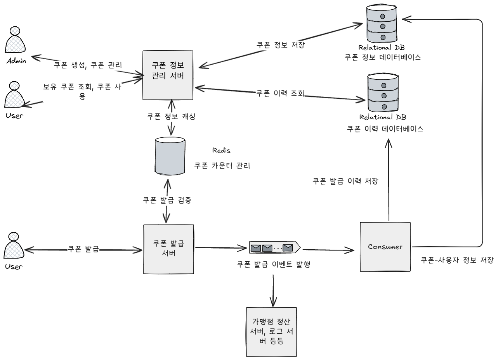

# Coupon_Dispatcher
쿠폰 발급 시스템 설계
***

## 목표
- 특정 시간에 한정된 수량의 쿠폰을 선착순으로 받을 수 있는 시스템 설계가 목표입니다.

## ERD

## 시스템 아키텍처

---
## 쿠폰 발급 플로우

트래픽이 몰리는 시점에 Lost Update 문제가 발생하여 쿠폰이 oversell 될 수 있습니다. 이를 해결하기 위해 다음의 두 가지 방법을 고민했습니다.
- 락을 이용한 동시성 제어.
- **원자적 증가를 지원하는 데이터베이스 사용. (선택방안)**

락을 사용하면 동시성은 제어할 수 있지만, 쿠폰 레코드에 대한 트랜잭션의 race condition이 발생해 성능적 측면에서
빠른 연산 처리 성능을 지닌 In-Memory 데이터베이스인 Redis를 사용하여 구현하였습니다.

Singe thread 기반으로 동작하는 Redis Event loop에서는 Lua Script를 단일 명령어로 취급해 원자적 처리가 가능합니다. 
다음 Lua Script를 통해 Set을 통해 중복 발급을 검증하고, 쿠폰 발급 한도를 검증했습니다.
~~~
-- 발급한 사용자 검증용
local issuedMemberSet = KEYS[1]
-- 쿠폰 한도 검증용
local couponCounter = KEYS[2]
local limit = tonumber(ARGV[1])
local memberId = ARGV[2]
			
-- 발급된 수량, 기본값 0
local issued = tonumber(redis.call('GET', couponCounter) or '0')
	
-- 발급 한도 검증
if issued >= limit then 
-- 1: 이미 품절된 쿠폰입니다.
return 1
end
	
-- 중복 발급 검증
if redis.call('SISMEMBER', issuedMemberSet, memberId) == 1 then 
-- 2: 이미 발급한 쿠폰입니다.
return 2
end
	
redis.call('SADD', issuedMemberSet, memberId)
redis.call('INCR', couponCounter)
	
-- 쿠폰 발급에 성공
return 0
~~~

쿠폰 발급이 성공하면 메세지 큐에 쿠폰 발급 이벤트를 발행해 컨슈머 측에서 이를 소비해 비동기로 DB에 영속화합니다. 다음과 같은 두 가지 이유로
메시지 큐를 도입하였습니다.
- 쿠폰 이력을 저장하는 로직이 무거우면 트래픽이 몰리는 시점에서 API 서버에 부하가 생길 것입니다.
- 쿠폰을 발급함으로써 이를 처리해야 하는 다른 서비스가 존재할 경우 확장성을 위함입니다.
  - ex) 쇼핑몰에서 이를 발급 시, 가맹점에 지급해야 할 쿠폰 대금 처리

---

## 추가적인 고민 및 개선해볼 사항

### 서비스 분리
현재 API 서버에서 이력 저장을 빼고는 모두 처리하고 있는 상태이다. 만약 서비스가 성장해 트래픽이 커지면, 서비스를 분리해 부하를 줄일 수 있다.

### 이력 저장 컨슈머
분리한 이유는 위와 같이 API 서버의 부하를 줄이기 위해서다. 배치로 메시지 큐에서 이벤트들을 가져와 저장한다. 이때 벌크 + 비동기 방식으로 insert
성능을 높일 수 있다.
- 현재 (쿠폰 ID + 사용자 ID) 복합키로 유니크 제약을 통해 중복 소비 문제를 방지한 상태다. 

### 이벤트 발행 실패
현재 흐름에서는 다음의 4가지 경우가 가능하다.
1. 발급 성공, 이벤트 성공
2. 발급 성공, 이벤트 실패 
3. 발급 실패, 이벤트 성공 
4. 발급 실패, 이벤트 실패

1, 3, 4번의 경우는 사실상 문제가 없다. 발급 검증이 실패하면 이벤트 발행 로직으로 넘어가지 않고, 예외를 던지기 때문이다. 문제는 2번의 경우인데,
발급에 성공했지만, 이벤트 발행이 실패하면 이를 소비하는 서비스들에 문제가 발생할 수 있다. 이를 방지하기 위해 Transaction Outbox 패턴을 적용할 수 있다.
하지만, 현재 구조에서는 outbox 테이블에 저장하게 되면 쓰기 비용 상 이점이 없어 적용하지 않은 상태다.(이벤트 소비 후 로직이 무겁지 않음.)

### 비용에 관한 고민
이런 고민도 해볼 필요가 있다. 다음의 예시를 보자.
- 쿠폰 하나당 단가: 5000원
- Redis 도입 비용: 500만원
- 쿠폰 수량: 1000개

선착순 1000명만 받아야 할 쿠폰이 동시성 제어가 되지 않아 1050명이 받아버렸다. 그럼 기존 예산인 500만원(5000 * 1000)에서 
525만원(5000*1050)으로 25만이 초과하게 된다. 근데 oversell을 막기 위해 Redis를 도입하면 500만원이라는 금액을 25만원을 줄이기 위해 사용해야 한다.

배보다 배꼽이 더 큰 상황이다. 이런 경우, 차라리 50명에게 쿠폰을 더 발급해주던가 비용이 저렴한 다른 솔루션을 찾아볼 필요가 있다. 결국, 무작정
솔루션을 도입하는 것보다는 다양한 점들을 고려해서 합리적인 선택을 해볼 필요가 있다.